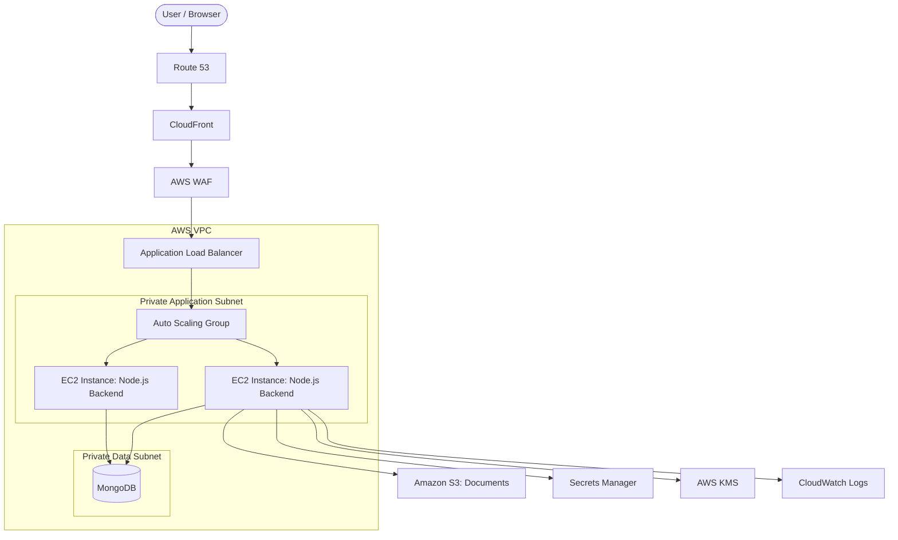

# Procurement Platform: AWS Deployment Guide

This document outlines the architecture, deployment strategy, and testing procedures for the Procurement Platform on AWS.

## 1. Architecture Diagram



## 2. Terraform Structure

The infrastructure is provisioned using a modular Terraform architecture located in the `terraform/` directory.

### Environments
- `terraform/environments/dev`: Development environment.
- `terraform/environments/stage`: Staging environment.
- `terraform/environments/prod`: Production environment.

### Modules
- **vpc**: Provisions custom VPC, public/private subnets, IGW, NAT Gateway, and Route Tables.
- **security-groups**: Strict network access controls for ALB and EC2.
- **iam**: Instance profiles for EC2 to securely access S3, KMS, and Secrets Manager.
- **kms**: Encryption keys for S3 buckets and Secrets.
- **s3**: Secure document storage.
- **secrets-manager**: Centralized secure credential management.
- **launch-template & asg**: EC2 launch templates and Auto Scaling Groups.
- **alb**: Application Load Balancer for routing traffic to instances.
- **cloudfront, waf, route53**: Edge caching, DNS, and Web Application Firewall.

## 3. Deployment Guide

### Prerequisites
1. Install [Terraform](https://www.terraform.io/downloads).
2. Install the [AWS CLI](https://aws.amazon.com/cli/) and configure your credentials (`aws configure`).
3. Ensure Docker and Docker Compose are installed for local testing.

### Step 1: Provision Infrastructure
Navigate to the desired environment and apply the configuration.

```bash
cd terraform/environments/dev
terraform init
terraform plan
terraform apply
```

### Step 2: Build and Deploy the Application
The application is fully Dockerized.
- The `docker-compose.yml` file is configured for local testing.
- For AWS deployment, build the Docker images and push them to an AWS ECR registry.
- Update the EC2 Launch Template's User Data script in `terraform/modules/launch-template/main.tf` to pull and run the Docker containers on instance boot.

## 4. Testing Guide

### Local Verification
1. Run the local stack:
   ```bash
   docker-compose up --build
   ```
2. The frontend is accessible at `http://localhost`. The backend is accessible at `http://localhost:5000`.
3. Verify workflows: Check Login, Procurement Dashboard, Purchase Requests, and Vendor Management.

### AWS Verification
After running `terraform apply`:
1. **Access**: Navigate to the DNS name output by the `route53` module.
2. **S3 Uploads**: Test uploading a document in the platform. Verify the object is encrypted using the KMS key in the S3 console.
3. **Secrets**: Ensure the backend connects successfully using database credentials retrieved from Secrets Manager.
4. **Auto Scaling**: Manually terminate an EC2 instance in the AWS console and observe the ASG launching a replacement instance to maintain the desired capacity.
5. **CloudWatch**: Check CloudWatch Logs to verify application logs are streaming correctly from the instances.
