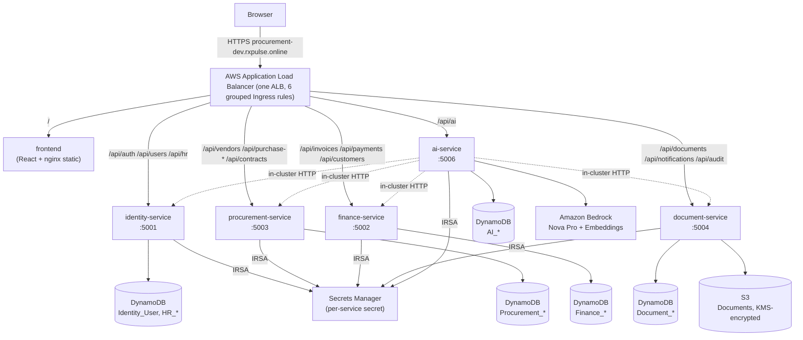
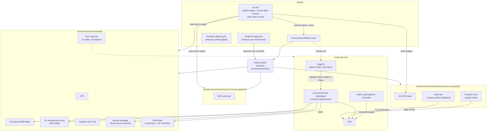

# Procurement Platform — Architecture

## 1. Application Architecture (microservices)

No custom API gateway — the ALB Ingress (AWS Load Balancer Controller) does all path-based routing directly to each service's Kubernetes Service. Every service is independently deployable, independently scaled, and reads its own secret from Secrets Manager via its own IRSA role (no shared credentials).

## 2. AWS Infrastructure Architecture

## 3. State and pipeline boundaries

| Concern | Owner | Trigger |
|---|---|---|
| VPC, EKS, DynamoDB, Cognito, Secrets Manager, IAM/IRSA | `terraform-apply.yml` | Manual, per environment (`shared`/`dev`/`prod`) |
| Destroying any environment | `terraform-destroy.yml` | Manual, requires typing environment name to confirm |
| Docker image build/push + Helm values bump | `cd.yml` | Auto on push to `main`; `workflow_dispatch` for manual/test runs on any branch |
| Actual deployment to the cluster | ArgoCD (in-cluster) | Auto-sync on every Helm values change pulled from Git — not from CI directly |
| Production traffic | `cd.yml`'s `deploy-prod` job | Only runs when `github.ref == refs/heads/main`, gated behind the `prod` GitHub Environment (manual approval) |

Terraform state lives in S3 (`procurement-tf-state-global`), one key per environment (`environments/{shared,dev,prod}/terraform.tfstate`), locked via DynamoDB (`terraform-state-lock`).
